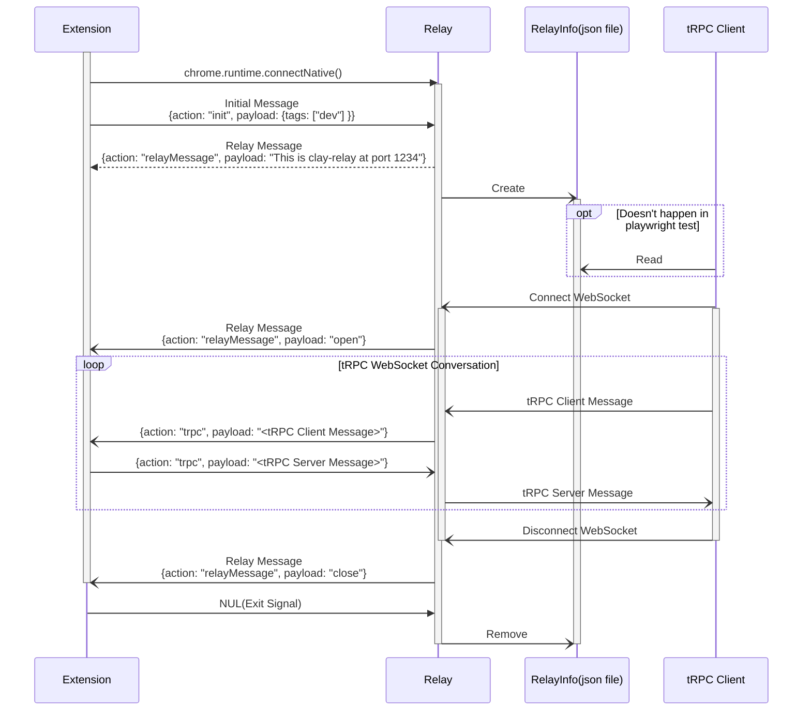

# clay-relay

```mermaid
sequenceDiagram
    activate Extension
    Extension->>Relay: chrome.runtime.connectNative()
    activate Relay
    Extension->>Relay: Initial Message<br>{action: "init", payload: {tags: ["dev"] }}
    Relay-->>Extension: Relay Message<br>{action: "relayMessage", payload: "This is clay-relay at port 1234"}
    Relay-)RelayInfo(json file): Create
    activate RelayInfo(json file)
    
    opt Doesn't happen in playwright test
    tRPC Client-)RelayInfo(json file): Read
    end
    tRPC Client-)Relay: Connect WebSocket
    activate Relay
    activate tRPC Client
    Relay-)Extension: Relay Message<br>{action: "relayMessage", payload: "open"}
    loop tRPC WebSocket Conversation
        tRPC Client-)Relay: tRPC Client Message
        Relay-)Extension: {action: "trpc", payload: "<tRPC Client Message>"}
        Extension-)Relay: {action: "trpc", payload: "<tRPC Server Message>"}
        Relay-)tRPC Client: tRPC Server Message
     end
    tRPC Client-)Relay: Disconnect WebSocket
    deactivate Relay
    deactivate tRPC Client
    Relay-)Extension: Relay Message<br>{action: "relayMessage", payload: "close"}
    
    deactivate Extension
    Extension->>Relay: NUL(Exit Signal)
    Relay-)RelayInfo(json file): Remove
    deactivate RelayInfo(json file)
    deactivate Relay
```
