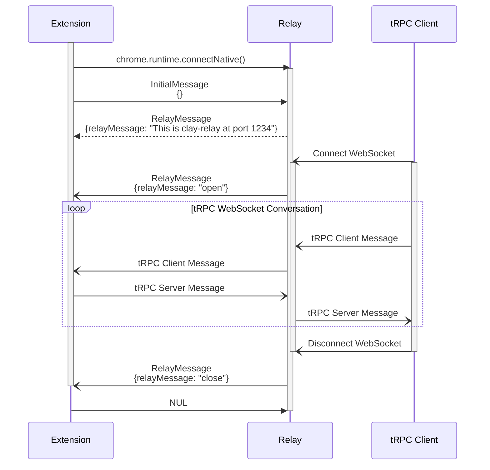

# clay-relay

```mermaid
sequenceDiagram
    activate Extension
    Extension->>Relay: chrome.runtime.connectNative()
    activate Relay
    Extension->>Relay: InitialMessage<br>{}
    Relay-->>Extension: RelayMessage<br>{relayMessage: "This is clay-relay at port 1234"}
    
    tRPC Client-)Relay: Connect WebSocket
    activate Relay
    activate tRPC Client
    Relay-)Extension: RelayMessage<br>{relayMessage: "open"}
    loop tRPC WebSocket Conversation
        tRPC Client-)Relay: tRPC Client Message
        Relay-)Extension: tRPC Client Message
        Extension-)Relay: tRPC Server Message
        Relay-)tRPC Client: tRPC Server Message
     end
    tRPC Client-)Relay: Disconnect WebSocket
    deactivate Relay
    deactivate tRPC Client
    Relay-)Extension: RelayMessage<br>{relayMessage: "close"}
    
    deactivate Extension
    Extension->>Relay: NUL
    deactivate Relay
```
